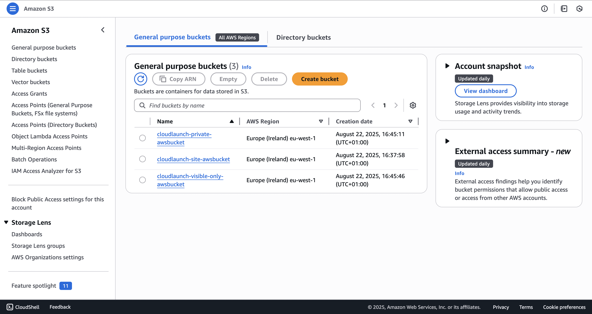
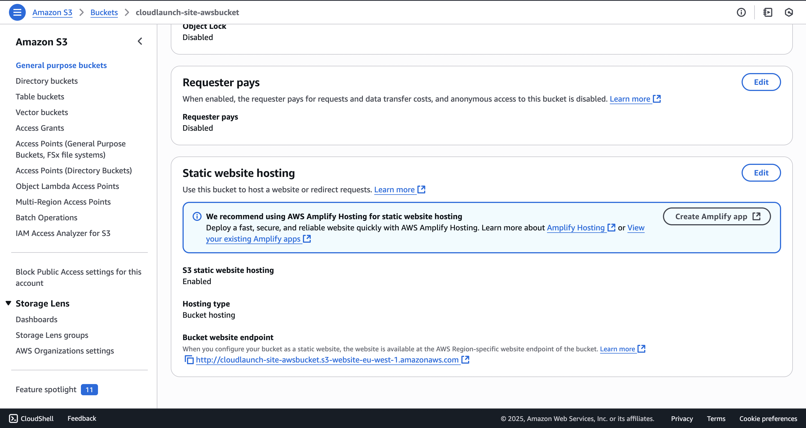
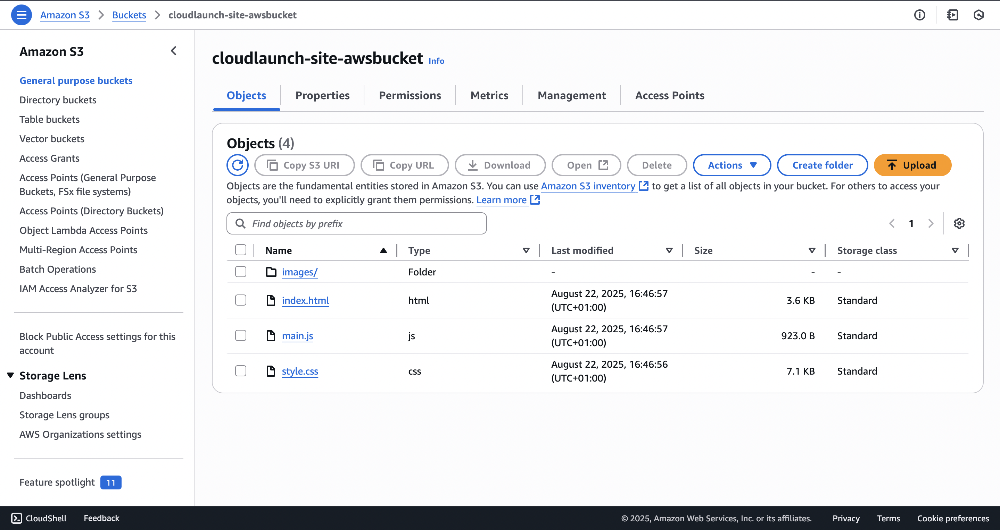
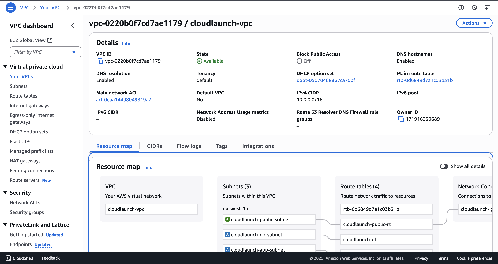
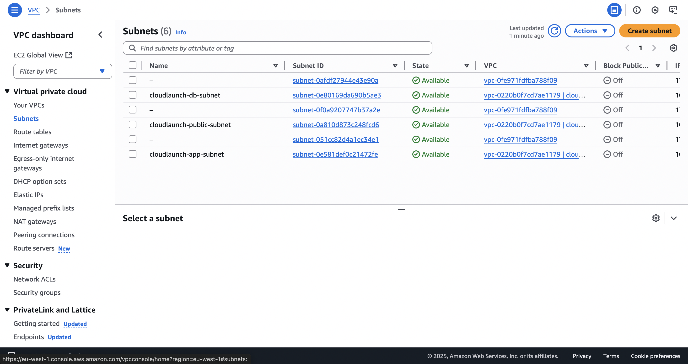
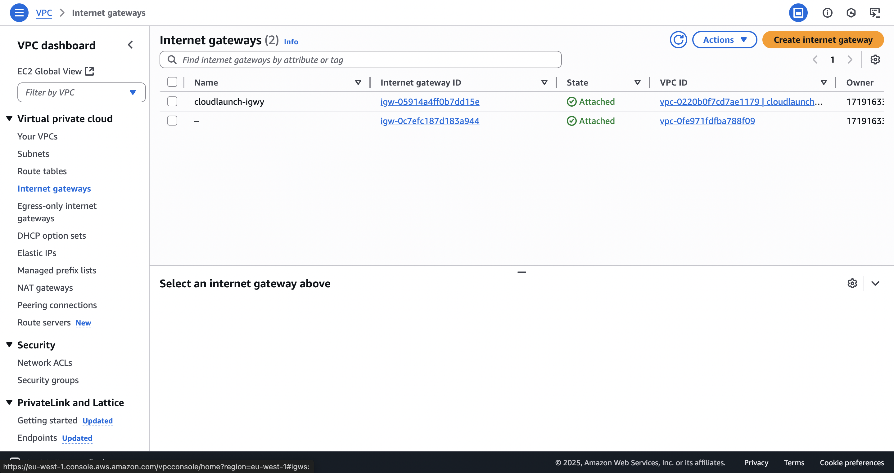
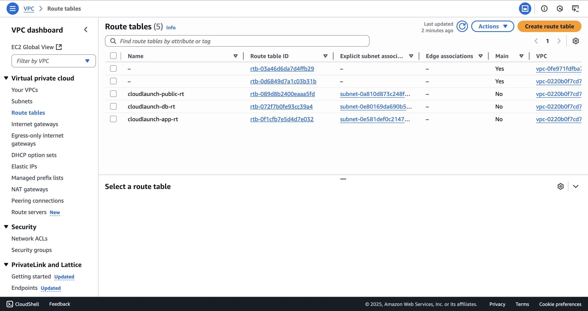
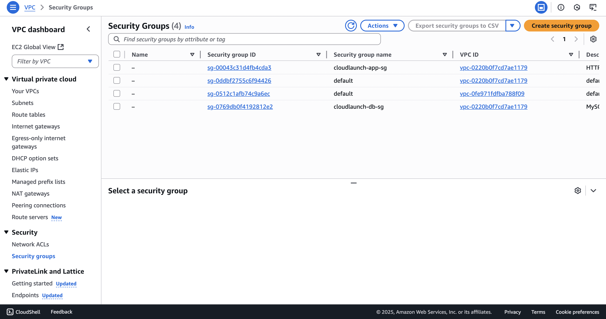

# CloudLaunch Infrastructure Setup

This repository documents the setup of the **CloudLaunch environment** on
AWS as part of the Cloud Engineering project.

---

## Tools & Services Used

- **AWS Services:** S3, CloudFront, VPC, IAM
- **Tools:** AWS Management Console, JSON IAM Policies

---

## Task 1: S3 Static Website Hosting

- **Created an S3 bucket** named `cloudlaunch-site-awsbucket` (unique name in
  AWS).



- Disabled **Block Public Access** to allow public reads.

- **Enabled static website hosting** in the bucket.



- **Uploaded static HTML/CSS/JS files** for my static website.



- **Configured bucket policy** to allow public access for static site
  hosting.

## Bucket Policy

```json
{
  "Version": "2012-10-17",
  "Statement": [
    {
      "Sid": "PublicReadGetObject",
      "Effect": "Allow",
      "Principal": "*",
      "Action": "s3:GetObject",
      "Resource": "arn:aws:s3:::cloudlaunch-site-awsbucket/*"
    }
  ]
}
```

- Configured **CloudFront** for content distribution.

## Deployment Links

🔗 **S3 Static Website URL:**  
[Static Website URL](http://cloudlaunch-site-awsbucket.s3-website-eu-west-1.amazonaws.com/)

🔗 **CloudFront Distribution URL:**  
[CloudFront URL](https://d3m8fx0y8hc3dv.cloudfront.net/)

---

## Task 2: VPC Design for CloudLaunch Environment

Designed a secure and logically separated **Virtual Private Cloud (VPC)**
for future CloudLaunch workloads.



### VPC Details

- **VPC Name:** `cloudlaunch-vpc`
- **CIDR Block:** `10.0.0.0/16`

### Subnets

- **Public Subnet:** `10.0.1.0/24` (for load balancers or future
  public-facing services)
- **Application Subnet:** `10.0.2.0/24` (for private app servers)
- **Database Subnet:** `10.0.3.0/28` (for private RDS-like services)



### Internet Gateway

- Created an **Internet Gateway** named `cloudlaunch-igwy`.



- Attached it to `cloudlaunch-vpc`.

### Route Tables

- **Public Route Table (`cloudlaunch-public-rt`):**
  - Associated with `cloudlaunch-public-subnet`.
  - Default route `0.0.0.0/0` points to `cloudlaunch-igwy`.
- **Private Route Tables:**
  - `cloudlaunch-app-rt` → associated with App Subnet (no internet
    access).
  - `cloudlaunch-db-rt` → associated with DB Subnet (no internet access).



### Security Groups

- **cloudlaunch-app-sg**
  - Allows **HTTP (80)** traffic **within the VPC only**.
- **cloudlaunch-db-sg**
  - Allows **MySQL (3306)** traffic only from **App Subnet**.



## IAM Policies

An IAM user `cloudlaunch-user` was created with **limited permissions**.
The attached JSON policy is:

```json
{
  "Version": "2012-10-17",
  "Statement": [
    {
      "Effect": "Allow",
      "Action": "s3:ListAllMyBuckets",
      "Resource": "*"
    },
    {
      "Effect": "Allow",
      "Action": ["s3:ListBucket"],
      "Resource": [
        "arn:aws:s3:::cloudlaunch-site-awsbucket",
        "arn:aws:s3:::cloudlaunch-site-private-awsbucket",
        "arn:aws:s3:::cloudlaunch-site-visible-only-awsbucket"
      ]
    },
    {
      "Effect": "Allow",
      "Action": ["s3:GetObject"],
      "Resource": [
        "arn:aws:s3:::cloudlaunch-site-awsbucket/*",
        "arn:aws:s3:::cloudlaunch-site-private-awsbucket/*"
      ]
    },
    {
      "Effect": "Allow",
      "Action": ["s3:PutObject"],
      "Resource": ["arn:aws:s3:::cloudlaunch-site-private-awsbucket/*"]
    }
  ]
}
```

Permissions created for VPC Components(Read-only).
The attached JSON policy is:

```json
{
  "Version": "2012-10-17",
  "Statement": [
    {
      "Effect": "Allow",
      "Action": [
        "ec2:DescribeVpcs",
        "ec2:DescribeSubnets",
        "ec2:DescribeRouteTables",
        "ec2:DescribeInternetGateways",
        "ec2:DescribeSecurityGroups"
      ],
      "Resource": "*"
    }
  ]
}
```

## Notes

- CloudFront distribution was properly configured.
- The S3 endpoint is guaranteed to serve the static website.
- VPC setup is documented and functional, though actual EC2 instance testing was not required for this task.

---

## 👨‍💻 Author

**Chidozie Ugwu**  
Cloud Engineering Student @ AltSchool Africa 2025
